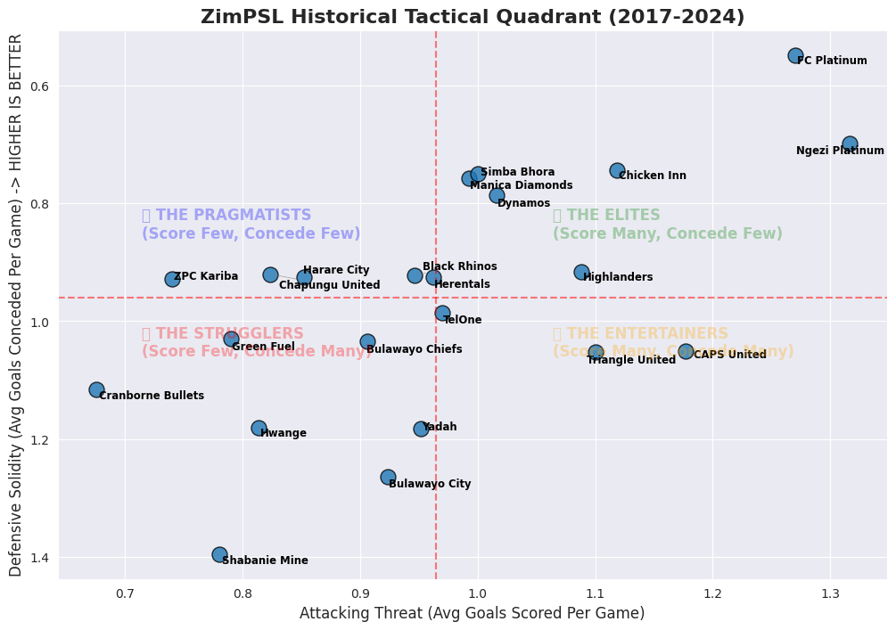

# tadiwaben.github.io

## 📁 Featured Projects
---

## ⚽ The ZimPSL Ultimate Entertainers: Sports Analytics & Web Scraping

A sports analytics pipeline engineered to look beyond standard points tables and mathematically measure spectator value ("entertainment index") across 8 seasons of the Zimbabwe Premier Soccer League (ZimPSL).

### 📊 Project Highlights
* **Automated Data Scraping**: Built custom Python extractors parsing 101 team-season records from historical league tables (2017–2024).
* **Feature Engineering**: Standardized goal rates, match volatility, and defensive risk metrics into a unified **Chaos & Entertainment Index**.
* **Tactical Profiling**: Mapped team playstyles into tactical quadrant matrices to isolate high-stakes, entertaining sides from low-volatility defensive teams.

### 🖼️ Visual Insights Preview

  

### 🛠️ Tech Stack
`Python` • `BeautifulSoup` • `Pandas` • `NumPy` • `Matplotlib / Seaborn`

[📊 Read Full Analysis Report](./zimpsl-entertainment-analysis.md) | [💻 View Scraper Code](./zimpsl_scraper.ipynb)

---

### ZimAuto Valuation Engine
## 🚗 ZimAuto: End-to-End Car Valuation & Negotiation Engine

An institutional machine learning application designed to resolve pricing opacity and asymmetry in the Zimbabwean secondary automobile market. The system automatically scrapes marketplace listings, models non-linear vehicle depreciation with target log scaling, and serves interactive bargaining guidance.

### 📊 Performance Highlights
* **Variance Explained ($R^2$)**: **0.790** (~79% of cross-market price variance explained)
* **Predictive Accuracy (MAE)**: **~$5,112 USD** average baseline dollar error across all vehicle segments
* **Dataset Scope**: 3,000+ cleaned vehicle records scraped across regional classifieds (*ZimAuto*, *ZimClassifieds*)
* **Statistical Governance**: Real-time residual Z-score filtering ($\pm3\sigma$) to catch data anomalies and structural risks

### 🛠️ Key Technologies
`Python` • `BeautifulSoup` • `XGBoost` • `Optuna` • `Scikit-Learn` • `Gradio` • `Render`
👉 [Read Full Analysis](zimauto-evaluation-engine.md) | [Live Demo](zimauto-valuation-engine.onrender.com)
