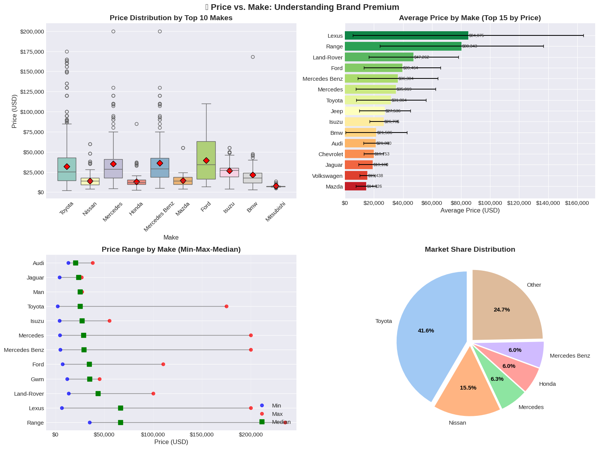
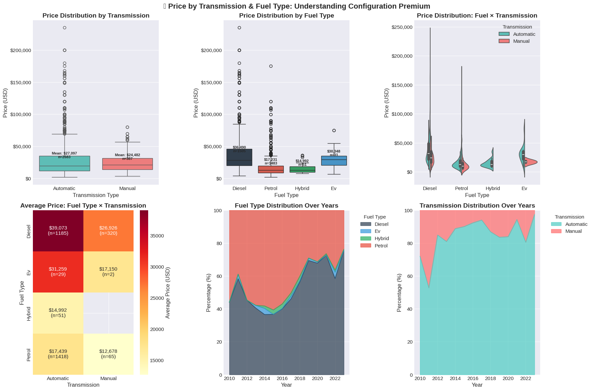
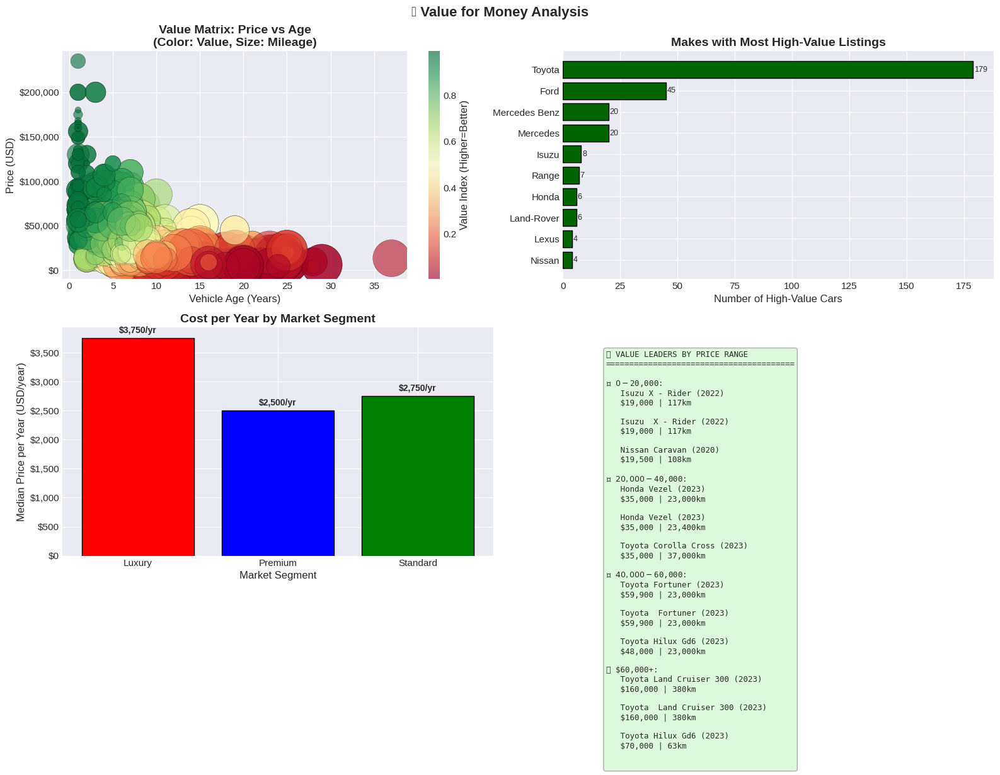
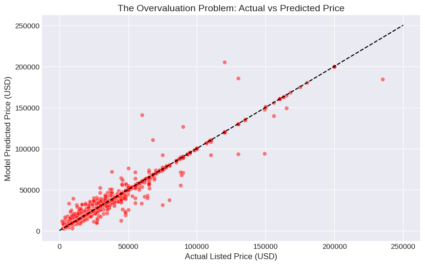

# 🚗 ZimAuto: End-to-End Car Valuation & Arbitrage Engine


---

## 📌 1. Executive Summary & Objective

The secondary automobile market in Zimbabwe suffers from significant pricing asymmetry, inconsistent valuation metrics, and market opacity. Buyers and sellers frequently struggle to determine the true fair market value of vehicles due to non-linear depreciation curves, varying mileage velocities, and brand prestige premiums.

The objective of this project was to build an end-to-end, data-driven machine learning system that:
1. **Scrapes and sanitizes** live automotive classifieds across regional platforms.
2. **Models non-linear depreciation dynamics** across vehicle age, usage rate, brand, transmission, and market segment.
3. **Resolves low-end market overvaluation** using target log-transformation algorithms.
4. **Deploys an interactive web interface** providing fair market valuations, confidence scores, and real-world bargaining bounds.

---

## 📊 2. Exploratory Data Analysis & Market Insights

### A. Chronological Depreciation Patterns
Analyzing vehicle price against manufacturing year and age reveals strong exponential depreciation dynamics. Newer vehicles lose value rapidly within their first five years before stabilizing into a steady baseline curve.


> **Key Takeaway**: Vehicle prices correlate positively with year ($r = 0.476$). The average price jumps significantly for post-2020 inventory due to import tariff structures and newer technology baselines.

---

### B. Usage-Based Depreciation (Mileage Analysis)
Cumulative mileage acts as a continuous penalty against asset valuation. However, value loss per kilometer decays exponentially—the highest drop in value occurs within the first $30,000\text{ km}$.


---

### C. Brand Premiums & Market Dominance
Market share in the region is heavily concentrated. **Toyota** commands **41.6%** of total marketplace listings, demonstrating strong liquidity and value retention compared to European luxury brands.



---

### D. Configuration & Transmission Premiums
Automatic diesel configurations dominate the upper price brackets, driven by heavy utility demand (commercial trucks and off-road SUVs).



---

### E. Mileage Velocities & Usage Relationships
Calculating the annual usage rate ($\text{Annual Mileage} = \frac{\text{Mileage}}{\text{Age}}$) provides crucial insights into how intensely vehicles are driven relative to national baselines.


---

### F. Brand-Specific Value Retention Curves
Different vehicle brands retain value at vastly different rates after 5 years of operation. Commercial brands like **Isuzu** retain up to **63.1%** of their original value, whereas luxury sedans suffer steep 5-year drops.


---

### G. Value Matrix & Segment Efficiency
By mapping vehicle cost per operational year across market segments (**Luxury**, **Premium**, **Standard**), we isolate high-value listings that offer maximum functional lifespan per dollar spent.



---

### H. Multivariate 3D Depreciation Surfaces
A dual-axis linear model is insufficient to capture price behavior. Mapping Price against Year and Mileage simultaneously reveals a non-linear regression surface.


---

### I. Feature Correlation & Structure
A comprehensive correlation matrix confirms that while Year ($r = 0.476$) and Vehicle Age ($r = -0.476$) are strong linear drivers, interaction effects with Mileage and Market Segment require gradient-boosted decision trees.


---

## ⚙️ 3. Machine Learning Engine & The Overvaluation Fix

### The Heavy-Tail Overvaluation Problem
When training standard decision tree regressors on raw dollar values, the objective function minimizes absolute dollar errors ($MAE = \frac{1}{n}\sum \vert{}y_i - \hat{y}_i\vert{}$). Consequently, a $\$10,000$ error on a $\$200,000$ Land Cruiser receives the same weight as a $\$10,000$ error on a $\$2,000$ Toyota Harrier.

This caused the baseline model to heavily overvalue low-cost, budget vehicles:



### The Mathematical Solution: Target Log Transformation
To force the algorithm to evaluate relative percentage errors rather than raw dollar magnitudes, we applied a logarithmic transformation to the target variable:

$$y_{\text{transformed}} = \log(1 + \text{Price\_USD})$$

The XGBoost regressor was retrained on $y_{\text{transformed}}$ and evaluated by applying the inverse exponential function ($\text{expm1}$) to predictions:

$$\hat{y}_{\text{dollars}} = \exp(\hat{y}_{\text{transformed}}) - 1$$

```python
# Retraining Pipeline with Log Transformation
import numpy as np
from xgboost import XGBRegressor

# Log-transform target variable
y_train_log = np.log1p(y_train)

# Fit XGBoost Regressor
xgb_log = XGBRegressor(
    n_estimators=300,
    max_depth=6,
    learning_rate=0.05,
    subsample=0.8,
    random_state=42
)
xgb_log.fit(X_train, y_train_log)

# Predict and inverse-transform
log_preds = xgb_log.predict(X_test)
final_dollar_preds = np.expm1(log_preds)
