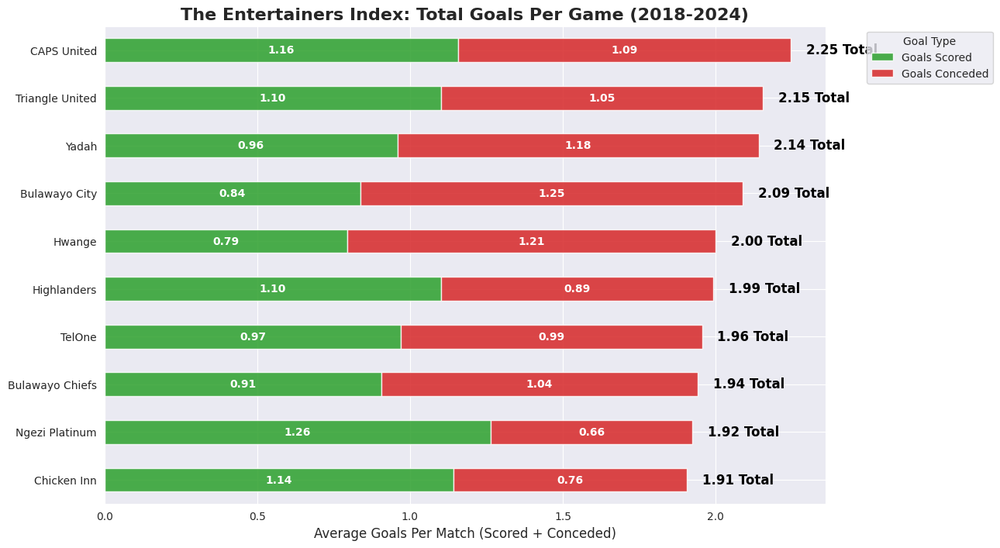
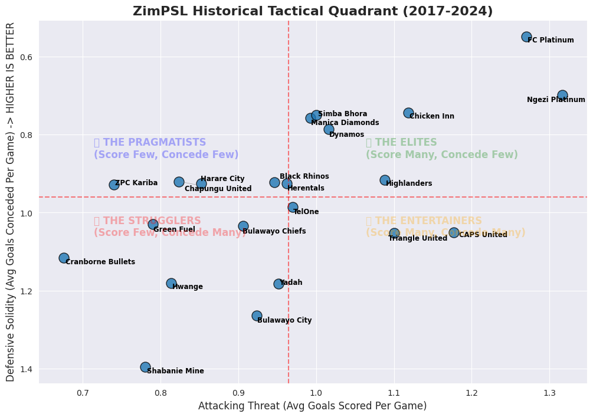

# 🍿 The ZimPSL Ultimate Entertainers (2017-2024)

## 📌 1. Executive Summary & Objective
In professional football, league tables only measure efficiency—who accumulated the most points. They fail to capture which teams actually provide the most heart-stopping drama for the fans. 

The objective of this project was to look beyond traditional point standings and quantitatively identify the most **entertaining** teams in the Zimbabwe Premier Soccer League (ZimPSL). I hypothesized that "entertainment" can be mathematically defined as teams that play high-stakes, chaotic football: scoring frequently while simultaneously leaving their defense exposed to concede just as often.

## 🛠️ 2. Data Engineering & Web Scraping
Because consolidated historical statistics for the ZimPSL are not readily available in clean, centralized databases, acquiring the data required building a custom extraction pipeline.

* **Web Scraping:** Utilized `BeautifulSoup` and `Requests` in Python to parse unstructured historical seasonal league tables directly from Wikipedia (spanning 2017–2024).
* **Data Cleaning:** The raw scrape generated a dataset of 101 distinct team-season records. I wrote scripts in `Pandas` to resolve inconsistencies caused by varying league structures (e.g., seasons with 18 teams versus irregular match counts due to disruptions).
* **Feature Engineering:** Aggregated separate seasonal statistics into historical club careers. To ensure fair comparisons between legacy top-flight mainstays and newly promoted sides, absolute goals were normalized into per-game averages.

## 🧮 3. The "Entertainment Index"
To rank the teams objectively, I engineered a custom metric. Instead of measuring win efficiency, this metric calculates the total volume of goalmouth action a team produces per match:

$$\text{Entertainment Index} = \text{Average Goals Scored} (GF) + \text{Average Goals Conceded} (GA)$$

* **High Index:** Explosive, high-risk tactical approach.
* **Low Index:** Defensive, risk-averse, or low-scoring tactical setup.

---

## 📊 4. Visualizations & Tactical Mapping

### The Top 10 Ultimate Entertainers
This stacked bar chart breaks down the direct distribution of goals scored versus goals conceded. **CAPS United** emerged as the ultimate entertainer of Zimbabwean football, averaging a massive **2.25 total goals per match** across 170 games. They tightly balance high attacking output with a fragile defensive line.

### The Historical Tactical Quadrant
By plotting Attacking Threat (Goals Scored) on the X-axis against Defensive Solidity (Goals Conceded - inverted) on the Y-axis, we can cluster the league into four distinct tactical profiles. 

This matrix separates the **Pragmatists** (low scoring, low conceding) from the absolute **Entertainers** (CAPS United, Triangle United), while highlighting just how dominant **The Elites** (FC Platinum and Ngezi Platinum) are in maintaining both attack and defense.

---

## 💡 5. Analytical Conclusions
1. **Strategic Trade-offs:** The data clearly proves that entertainment value does not guarantee silverware. CAPS United provides incredible matchday drama but sacrifices defensive consistency, firmly placing them as "Entertainers" rather than title favorites.
2. **The Elite Benchmark:** FC Platinum manages an incredible win-rate profile because they maximize attacking returns while maintaining the tightest defensive structure in modern ZimPSL history.

## 💻 6. Access the Code
The complete Python data engineering pipeline (including BeautifulSoup scraping and Pandas cleaning) is hosted directly in this repository:
## 💻 6. Access the Code
The complete Python data engineering pipeline (including BeautifulSoup scraping and Pandas cleaning) is hosted directly in this repository:
[**View the Jupyter Notebook**](https://github.com/tadiwaaa/tadiwaaa.github.io/blob/main/zimpsl_scraper.ipynb)
